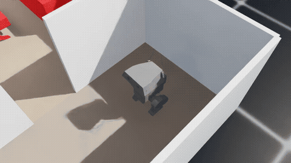
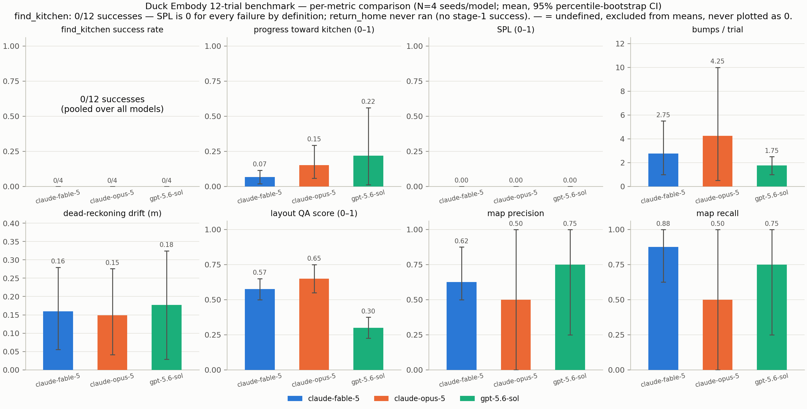
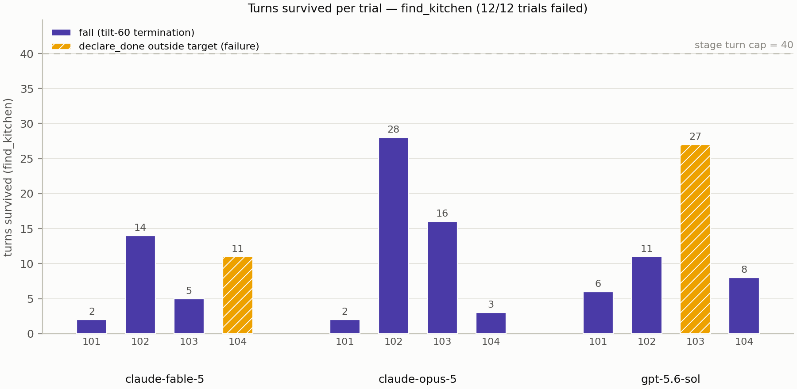
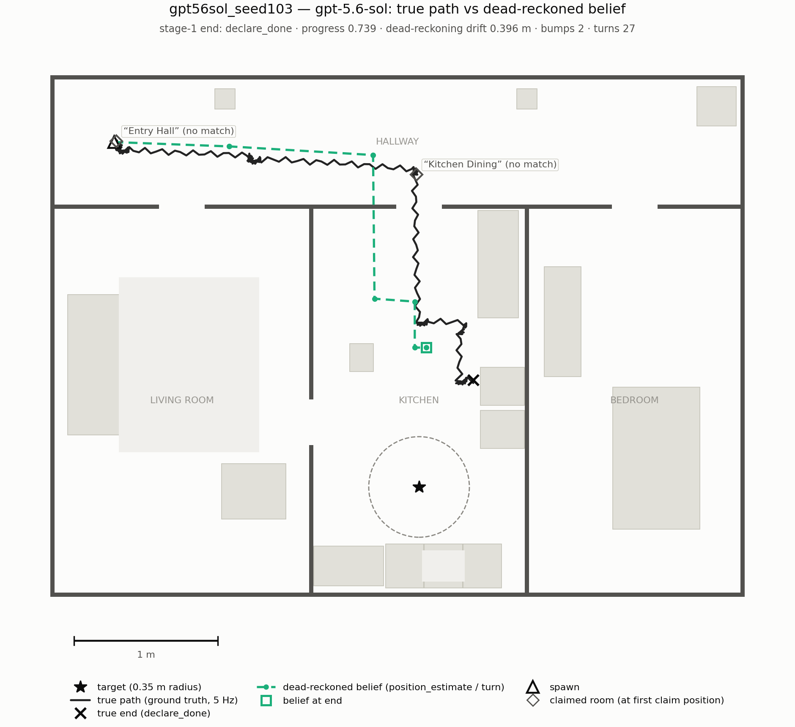

# Duck Embody 🦆

**LLM-as-SLAM: can a language model navigate a walking robot through an unknown
apartment — with no mapping system except its own memory?**

> **Benchmark complete** (batch run 2026-07-27): 3 frontier models × 4 seeds,
> one frozen config. Headline: **0/12 successes — an honest null**, and the
> per-trial evidence for why. See [Results](#results).

An LLM (Claude / GPT / open-weight VLM) controls a simulated 42 cm bipedal robot
([Open Duck Mini v2](https://github.com/apirrone/Open_Duck_Mini)) in NVIDIA Isaac Sim
through tool calls: it sees egocentric camera frames, issues velocity commands to a
pretrained RL locomotion policy, and must **find the kitchen in an apartment it has
never seen**. There is no SLAM, no occupancy grid, no depth sensor. The model
authors its own map as text — rooms, exits, landmarks — dead-reckons its position,
and corrects drift by recognizing places it has seen before ("cognitive loop
closure"). The harness stores and formats that memory; every spatial fact in it was
asserted by the model from its own observations.

## Why this is interesting

- Anthropic's ["How Claude Performs on Robotics Tasks"](https://www.anthropic.com/research/claude-plays-robotics)
  (Jul 2026) found frontier models drive robots well through high-level velocity
  commands but *"fail at tasks that require stable spatial memory, self-localization,
  or long open-loop plans."* This project asks: **is that a model limitation, or a
  harness limitation?** We give the model the memory scaffolding their harness
  lacked and measure what changes.
- A prior-art sweep (~40 repos/papers, 2026-07-26) found no published system where
  the language model is sole holder of both the map and the position estimate:
  existing work either lets classical geometry build the map (VLMaps, SG-Nav, VLFM…),
  gets nodes free from a discrete simulator graph (MapGPT), or keeps no memory at
  all (VLMnav). This slot appears to be unoccupied.
- The embodiment is harsher than the paper's Go2 quadruped: a biped that can
  actually fall, a 0.22 m/s velocity envelope, and a bobbing head-mounted camera
  0.36 m above the floor.

## What gets measured

Several frontier models run the identical task set — same apartment, same tools,
same prompt, fixed seeds: **find the kitchen and reach the counter**, then
**return to the start** (the direct test of whether the self-built map is real).
Metrics: success rate, time-to-kitchen, path efficiency (SPL), falls/bumps, and —
because the harness stores the model's map — **map accuracy scored against ground
truth**, something aggregate task metrics can't see.

## Architecture (one paragraph)

A persistent Isaac Sim process runs the duck under a pretrained PPO policy
(59-dim proprioceptive observations, 50 Hz control; trained in Isaac Lab in the
[parent robot project](https://github.com/XiaohuiChen-personal/Open_Duck_Mini_Jetson)).
The sim **pauses while the model thinks** (measuring capability, not API latency —
the paper's protocol). Per turn the model receives one camera frame, compass
heading, a drifting dead-reckoned position, and its own re-injected map; it acts
through closed-loop motion macros (`turn_to_heading`, `move`) and memory tools
(`update_room`, `mark_exit`, `correct_position`, …). Details: [`AGENTS.md`](AGENTS.md)
(design decisions + full technical context) and [`docs/PLAN.md`](docs/PLAN.md).

## Results

**Batch:** 3 models (Fable 5 = `claude-fable-5`, Opus 5 = `claude-opus-5`,
GPT 5.6 sol = `gpt-5.6-sol`) × 4 seeds, one frozen config
(`config_hash cf29ec164676…`, [`results/freeze.json`](results/freeze.json)),
total spend **$9.63**, turn timestamps spanning 59 minutes wall-clock.
Reproduction commands, environment, and the full audit trail:
[`docs/EXPERIMENTS.md`](docs/EXPERIMENTS.md). Every number below is generated
from the frozen trial logs by [`scripts/build_scores.py`](scripts/build_scores.py)
and lives in [`results/scores.json`](results/scores.json) /
[`results/summary_table.md`](results/summary_table.md).

**Headline: 0/12 `find_kitchen` successes — an honest null.** Ten trials ended
in a fall; the two that did not both ended with the model calling `declare_done`
in the wrong place, believing it had arrived. `return_home` — the direct test of
whether the self-built map is real — therefore **never ran** (it is gated on
stage-1 success), so the benchmark produced no data on it beyond 0/4 per model
with the unrun stage counted a failure.

*The closest run of the batch (`gpt56sol_seed103`, 2× speed): GPT 5.6 sol
navigates out of the hallway into the kitchen and declares done **5 cm from the
face of a real counter** — the east-wall run (`counter_5`), not the south run
the goal point sits before, leaving it 0.83 m from the goal, outside the 0.35 m
success radius. Right room, wrong counter. Full video:
[`gpt56sol_seed103.mp4`](results/videos/gpt56sol_seed103.mp4).*

### Per-model aggregates (N=4 trials each, mean [95% bootstrap CI])

| Metric | Fable 5 | Opus 5 | GPT 5.6 sol |
|---|---|---|---|
| `find_kitchen` SR | 0/4 [0.00, 0.00] | 0/4 [0.00, 0.00] | 0/4 [0.00, 0.00] |
| `return_home` SR (unrun = failure) | 0/4 [0.00, 0.00] | 0/4 [0.00, 0.00] | 0/4 [0.00, 0.00] |
| Progress toward kitchen (mean) | 0.066 [0.019, 0.115] | 0.151 [0.058, 0.293] | 0.218 [0.011, 0.560] |
| Progress (median) | 0.063 | 0.094 | 0.067 |
| Stage-1 turns survived (cap 40) | 8.00 [3.50, 12.50] | 12.25 [2.50, 22.00] | 13.00 [7.00, 22.25] |
| Bumps / trial | 2.75 [1.00, 5.50] | 4.25 [0.50, 10.00] | 1.75 [1.00, 2.50] |
| Falls / trial | 0.75 [0.25, 1.00] | 1.00 [1.00, 1.00] | 0.75 [0.25, 1.00] |
| Dead-reckoning drift (m) | 0.160 [0.056, 0.280] | 0.149 [0.041, 0.276] | 0.177 [0.029, 0.325] |
| `correct_position` calls | 0.00 [0.00, 0.00] | 0.00 [0.00, 0.00] | 0.00 [0.00, 0.00] |
| Map precision | 0.625 [0.500, 0.875] | 0.500 [0.000, 1.000] | 0.750 [0.250, 1.000] |
| Map recall | 0.875 [0.625, 1.000] | 0.500 [0.000, 1.000] | 0.750 [0.250, 1.000] |
| Layout-QA score (0–1) | 0.575 [0.500, 0.650] | 0.650 [0.550, 0.750] | 0.300 [0.225, 0.375] |
| Cost (USD / trial)¹ | 1.100, sum $4.40 | 0.877, sum $3.51 | 0.429, sum $1.72 |
| Stage-1 end reasons | fall ×3, wrong declare ×1 | fall ×4 | fall ×3, wrong declare ×1 |

SPL is 0.000 for every model (it is success-gated); time-to-kitchen is "—"
everywhere (defined only on success — never coerced to 0). Full table with every
metric, per-question QA and token counts:
[`results/summary_table.md`](results/summary_table.md) /
[`results/scores.json`](results/scores.json). Statistics: percentile bootstrap,
10,000 resamples, fixed seed ([`docs/METRICS.md`](docs/METRICS.md) §4).

¹ Cost compares bills, not capabilities: OpenAI caches prompts automatically at
0.1× while Anthropic uses explicit cache markers (both were live for the batch).

### Per-trial results

The per-trial table ships with every aggregate (a hard rule of this repo —
[`docs/METRICS.md`](docs/METRICS.md) §0). Raw evidence per row:
`results/raw/<trial>.json` + `results/videos/<trial>.mp4`.

| Trial | Stage-1 end | Progress | Turns | Bumps | Falls | Drift (m) | QA | Video |
|---|---|---|---|---|---|---|---|---|
| fable5_seed101 | fall | 0.048 | 2 | 1 | 1 | 0.015 | 0.60 | [mp4](results/videos/fable5_seed101.mp4) |
| fable5_seed102 | fall | 0.000 | 14 | 7 | 1 | 0.336 | 0.50 | [mp4](results/videos/fable5_seed102.mp4) |
| fable5_seed103 | fall | 0.078 | 5 | 1 | 1 | 0.177 | 0.70 | [mp4](results/videos/fable5_seed103.mp4) |
| fable5_seed104 | declare_done (1.66 m out) | 0.137 | 11 | 2 | 0 | 0.110 | 0.50 | [mp4](results/videos/fable5_seed104.mp4) |
| opus5_seed101 | fall | 0.047 | 2 | 1 | 1 | 0.015 | 0.60 | [mp4](results/videos/opus5_seed101.mp4) |
| opus5_seed102 | fall | 0.119 | 28 | 13 | 1 | 0.168 | 0.50 | [mp4](results/videos/opus5_seed102.mp4) |
| opus5_seed103 | fall | 0.069 | 16 | 3 | 1 | 0.345 | 0.80 | [mp4](results/videos/opus5_seed103.mp4) |
| opus5_seed104 | fall | 0.368 | 3 | 0 | 1 | 0.067 | 0.70 | [mp4](results/videos/opus5_seed104.mp4) |
| gpt56sol_seed101 | fall | 0.112 | 6 | 1 | 1 | 0.006 | 0.30 | [mp4](results/videos/gpt56sol_seed101.mp4) |
| gpt56sol_seed102 | fall | 0.023 | 11 | 3 | 1 | 0.253 | 0.40 | [mp4](results/videos/gpt56sol_seed102.mp4) |
| gpt56sol_seed103 | declare_done (0.83 m out) | 0.740 | 27 | 2 | 0 | 0.396 | 0.30 | [mp4](results/videos/gpt56sol_seed103.mp4) |
| gpt56sol_seed104 | fall | 0.000 | 8 | 1 | 1 | 0.051 | 0.20 | [mp4](results/videos/gpt56sol_seed104.mp4) |

### The two-layer findings story

**Layer 1 — the benchmark is fall-limited first.** 10 of 12 trials ended in a
fall. The frozen fall diagnostics (`fall_diagnostics` in `results/raw/*.json`,
cross-checked by the [Rule-11 video audits](results/audit_notes.md)) split them
cleanly in two:

- **5 hull-limit spin falls** — commanded |wz| = **0.5 rad/s exactly**, the
  locked policy's rotation-command hull limit (four during `turn_to_heading`,
  one during a `move` with the heading servo saturated): fable5_seed102/103,
  gpt56sol_seed101/102/104. The audited case (fable5_seed102) tips over in
  contact with a corridor wall, 0.58 s into a max-rate in-place turn right
  after a bump.
- **5 forward-step topples** — during a `move` at |wz| 0.02–0.29, **four of the
  five with a bump logged at the fall step**: fable5_seed101, opus5_seed101–104.

Falls concentrate around hull-limit rotation commands and obstacle contact —
usually adjacent rather than simultaneous: nine of the ten falls log a bump at
the fall step or within the two turns before it (the exception, opus5_seed104,
toppled with zero bumps in its trial). The LLM has no balance channel — its
only safety lever is *which commands it issues* — and
nothing in its observations or prompt says that max-rate rotation near an
obstacle is dangerous (the prompt was frozen before this pattern was known; see
[caveats](#honest-framing--caveats)).

**Layer 2 — past the falls, it is localization-limited.** The only two trials
that did not fall both ended with a confident `declare_done` in the wrong place:
Fable 5 (seed 104) declared at **1.66 m** from the goal, GPT 5.6 sol (seed 103)
at **0.83 m** — the closest any trial got to the 0.35 m success radius. The
seed-103 audit is the sharpest evidence in the batch: the model genuinely
navigated into the kitchen (`visited_rooms: hallway, kitchen`) and declared
**facing the east-wall counter run at 5.1 cm from the face of `counter_5`** —
the same white Sektion cabinet asset as the goal counters, mapped in its own
landmark notes as "white counter/peninsula projects westward from east wall."
It satisfied the objective's literal text ("walk to the counter") at a genuine
counter; the scored goal point sits before the *south* counter run, 1.14 m
away. *The room identification was right, the counter was real, the declared
position was short* — and its dead-reckoned belief was 0.40 m off at that
moment, larger than the success radius itself.

*True path vs the model's dead-reckoned belief and claimed rooms for
gpt56sol_seed103 — the run where the gap between "found the room" and "localized
to 0.35 m" decided the outcome.*

**The loop-closure tool went unused.** `correct_position` — the distinctive
affordance of this maximum-scaffold configuration, the tool that exists exactly
to fix the layer-2 failure — was called **zero times in all 12 trials by all
three models** (the `corrections` row of
[`results/scores.json`](results/scores.json)). Mean final drift was
0.15–0.18 m per model — the same order as the 0.35 m radius.

**Differentiation despite the null.** Progress means order
GPT 5.6 sol > Opus 5 > Fable 5 (0.218 / 0.151 / 0.066), but the intervals
overlap — **indistinguishable at this N** — and GPT's mean is carried by the
single 0.740 run (its median is 0.067). Layout QA is the one metric where an
interval separates: GPT 5.6 sol 0.300 [0.225, 0.375] sits below both Fable 5
0.575 [0.500, 0.650] and Opus 5 0.650 [0.550, 0.750] — reported as a ranking
hypothesis at N=4, never as significance. The texture: Opus 5 leads QA but fell
4/4; Fable 5 had the shortest runs and the best map recall (0.875); GPT 5.6 sol
had the best progress, best map precision (0.750), fewest bumps (1.75) — and the
worst QA.

**Per-seed consistency suggests the world, not decoding noise, drives
outcomes.** On seed 101 all three models fell within 2 / 2 / 6 turns of the
same spawn; seed 102 produced every model's highest bump count (7 / 13 / 3).
At one trial per cell this is an observation, not a statistic — but it is the
pattern selective rerunning would have hidden, which is why the runner forbids it.

### What this says about LLM-as-SLAM feasibility on this stack

On this stack, the LLM-as-SLAM question was **never reached by 10 of 12
trials**: the binding constraint is issuing locomotion commands that a small
biped survives near furniture, and mean stage-1 length was 8–13 turns of a
40-turn budget — before the self-built map could be stress-tested, and before
`return_home` (the direct map test) ever ran. The second constraint, visible in
the two surviving trials, is metric-precision localization: room-level semantic
navigation worked at least once (seed 103 found the kitchen), but declaring
inside a 0.35 m radius on dead reckoning alone did not — and no model used the
correction tool provided for exactly that. Both layers are properties of the
stack (policy envelope + prompt + scaffold-affordance uptake) as much as of the
models; **this null is not evidence about the upper bound of LLM spatial
memory**, and dressing it up as either a capability verdict or a near-miss would
be dishonest in both directions.

### Scope — what these results do and do not claim

Quoting the claim limits frozen in
[design doc 06 §1](docs/designs/06-benchmark-evaluation.html) before the batch:

> What the benchmark **does** claim, if the data supports it: relative ranking
> of the three models on this task suite, under this one scaffold, in this one
> simulated apartment, with honest per-trial evidence published for every
> number.
>
> What it does **not** claim:
>
> - **No statistical significance claims.** N=4 trials per model is far too
>   small; we report ranking hypotheses with uncertainty intervals (§6).
> - **No generality claims beyond this embodiment** (one biped, one apartment,
>   simulation only, one prompt, one camera config).
> - **No claims about the unreleased original harness.** Anthropic's
>   `safety-research/embody` is unreleased (404 verified 2026-07-26); this is a
>   from-scratch build of the paradigm, not a reproduction of their code.
> - **No memory-scaffold causality claims** — without the ablation, we cannot
>   attribute success or failure to the scaffold itself.

This is a feasibility case study of one maximum-scaffold configuration, and the
null result is a finding.

## Honest framing & caveats

Linked from [`docs/EXPERIMENTS.md`](docs/EXPERIMENTS.md); metric edge cases and
known scoring limitations are in [`docs/METRICS.md`](docs/METRICS.md) §5.

- **N=4 per model, no significance.** The phrase "statistically significant"
  appears nowhere in this repo by rule; overlapping intervals are reported as
  indistinguishable at this N ([`docs/METRICS.md`](docs/METRICS.md) §0).
- **One apartment, one prompt, one camera config, one scaffold** — a
  feasibility case study, not a generality claim, and (without the ablation) no
  causality claim about the memory scaffold.
- **One locomotion policy, and the falls are dominated by its limits.** The
  locked `v4_robust` policy's eval record is 0.00 % falls over 3,200 push-free
  open-field episodes ([`policy/README.md`](policy/README.md)); this benchmark
  adds furniture contact and max-rate rotation commands, and 10/12 trials ended
  in its fall modes. Fall counts measure the policy-plus-command distribution,
  not model spatial memory.
- **Duck-scale visual domain.** The apartment is built at 0.4× scale around a
  0.36 m camera height; frames do not look like human-scale interiors, which
  plausibly hurts models trained on human-scale imagery — equally, for all
  three.
- **SimReady materials rendered degraded** in every run: missing MDL sibling
  modules put SimReady furniture on fallback shading (recorded, deliberately
  kept — identical frames for every model, and the scene-recognition gate
  passed on these exact frames; [doc 03](docs/designs/03-scene-design.html) §5).
- **The prompt was frozen before the fall pattern was known.** Nothing tells
  the model that hull-limit rotation near an obstacle risks a fall. Fair across
  models; clearly improvable scaffold.
- **"The counter" is ambiguous where the scoring is not.** The objective says
  "walk to the counter"; the kitchen contains two counter runs of the same
  asset (south — where the scored goal point sits — and east-wall), and the
  objective cannot name one without leaking layout knowledge. `gpt56sol_seed103`
  declared 5 cm from the east-wall run's face and scored `declared_elsewhere`.
  Identical ambiguity for all three models, so the comparison holds; a v2
  scoring fix is success within 0.35 m of *any* kitchen-counter face.
- **Judge-gate reliance.** Room recognizability was gated by an
  out-of-benchmark judge model (`claude-sonnet-5`,
  [`configs/models/judge.yaml`](configs/models/judge.yaml); gate design:
  [doc 04](docs/designs/04-camera-observation.html) §8) rather than human
  raters, to avoid tuning the scene to any contestant.
- **Decoding nondeterminism.** No provider offers deterministic decoding for
  these models (probes recorded in [`configs/models/`](configs/models/):
  Anthropic returns 400 on any sampling parameter; OpenAI returns 400 on
  `temperature=0`). Reproducibility rests on the fixed sim seeds; a rerun
  re-decodes every turn.
- **Sensor honesty.** Camera + compass + dead reckoning mirror the real robot's
  actual hardware (head CSI camera, BNO055 IMU, no depth/lidar). Ground-truth
  position is never given to the model.
- **Replication-and-extension** of the embody *paradigm* on a novel embodiment;
  the original harness is unreleased — this is a from-scratch implementation,
  not a fork.

## Process & attribution

Interface, tasks, metrics, and analysis designed by me; implementation is
AI-assisted (Claude Code) under my direction. The locomotion policy, simulation
stack, and robot model come from my Open Duck Mini Jetson project (Isaac Lab PPO
training on a DGX Spark). This project doubles as the sim-side prototype for that
robot's Phase 5 (on-board VLM navigation with Cosmos Reason2).
