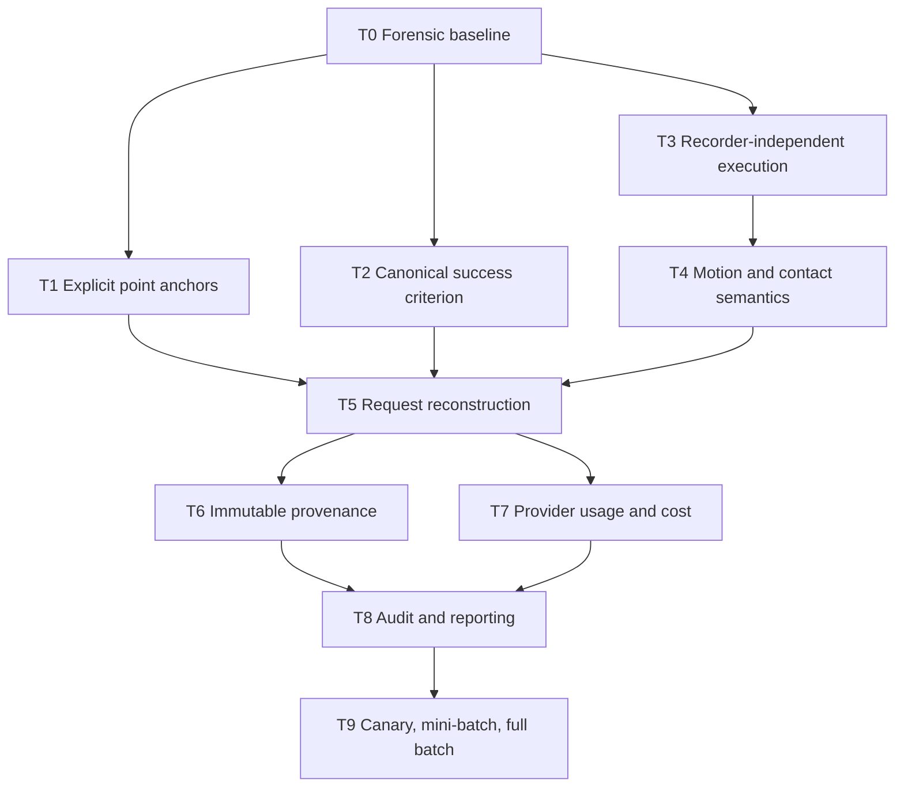
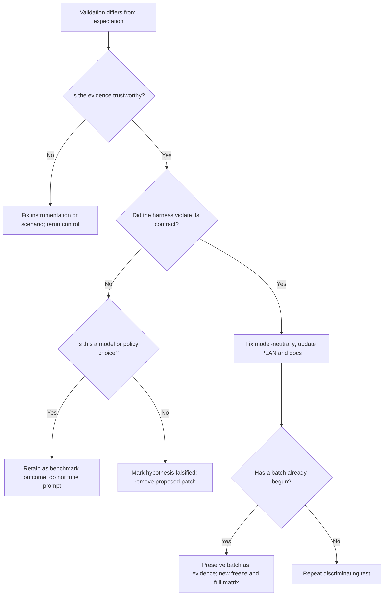

# Grok 4.5 Implementation Handoff — Duck Embody v5d_r2

Purpose: repair the confirmed harness defects described in
`docs/research/V5D_R2_HARNESS_FORENSICS.md`, validate each repair against a
discriminating failure case, then produce a new frozen full batch.

Audience: Grok 4.5 or another implementation agent starting with no chat
context. This document is the task prompt. Do not infer omitted requirements
from the old v4 completion state.

## Non-negotiable operating rules

Before editing:

1. Read `AGENTS.md` in full.
2. Read the relevant task section in `docs/PLAN.md`.
3. Read the design document named by AGENTS for every component touched.
4. Read `docs/research/V5D_R2_HARNESS_FORENSICS.md`.
5. Inspect the current code; do not assume this plan's line numbers remain
   exact.
6. Inspect git status. The owner controls commits. Do not commit or push unless
   explicitly asked.
7. Preserve all existing `results/raw*`, videos, scores, and freeze manifests.
   They are evidence, not scratch files.
8. Never use `git checkout --`, destructive reset, or a command that discards
   the owner's uncommitted work.

For every task below, follow AGENTS rule 10:

1. Adversarially review and update `docs/PLAN.md` before implementation.
2. Implement the corrected plan.
3. Add and run unit tests.
4. Perform an adversarial implementation review.
5. Run the named smoke.
6. Record the command, result, and artifact paths in `docs/PLAN.md`.

Simulation rules:

- One Isaac Sim/GPU job at a time.
- Use `PYTHONUNBUFFERED=1`.
- Use the Kit Python for all project tests and sim scripts.
- Any sim smoke records an mp4, filmstrip, and task-specific stills.
- Inspect video frame by frame. Video wins over aggregate metrics.
- Never launch a full paid batch until all preceding gates pass.

Fairness rules:

- The harness may store/format sensor data and model assertions.
- The harness must not choose a room, infer adjacency, rank frontiers, plan a
  route, or navigate on the model's behalf.
- Fix false or missing feedback model-neutrally.
- Do not tune prompts because one named contestant failed.
- Any behavior-affecting change creates a new freeze and a new full matrix.
- Never selectively rerun only failed cells.

## Desired final state

At completion:

- Loop closure operates on explicitly recorded point anchors and improves
  localization on a true revisit.
- The live and published success predicates are one versioned implementation.
- Recording observes control steps without changing command boundaries.
- Odometry is invariant to video recording and execution chunking.
- Motion macros stop on documented contact timing and cannot execute a blind
  multi-leg route in one model turn.
- Trial artifacts can reconstruct every harness-authored request.
- Every outcome-affecting input is bound into an immutable batch manifest.
- Provider costs use correct provider-specific cache semantics.
- Automated and visual audits both gate publication.
- A new 3×4 matrix runs under one manifest only after the canary and mini-batch
  gates pass.

## Task dependency graph



## T0 — Freeze the forensic baseline and add replay tools

Priority: P0 prerequisite

Behavior change: none

### Objective

Make every later change comparable to the current evidence. Create one parser
for raw trial facts so audits and tests stop reimplementing the schema
incorrectly.

### Context

`scripts/auto_audit.sh` reads nonexistent top-level correction/drift fields.
Generated Markdown contradicted raw JSON and hid the worst correction in the
batch. Before fixing behavior, pin the current findings with executable replay
checks.

### Files

Create or modify:

- `duck_embody/forensics.py` or an equivalently named pure module.
- `scripts/analyze_trial.py`.
- `tests/test_forensics.py`.
- `docs/PLAN.md`.

Do not edit existing raw results.

### Implementation

Provide pure functions:

- `iter_tool_calls(document)`.
- `iter_motion_calls(document)`.
- `correction_events(document)`.
- `correction_error_effects(document)`.
- `published_and_live_outcomes(document)`.
- `batch_integrity(documents, manifest)`.
- `visual_audit_status(batch_dir)`.

`correction_events` must reconstruct the true pose at the exact correction
position in a same-turn tool sequence:

1. Begin with the prior turn's true pose or spawn.
2. Advance through each earlier motion call using its scoring-only true pose.
3. Pair accepted writes with the cumulative correction records for the current
   stage-local turn.
4. Mark rejected calls separately.

Add a command that reads `results/raw_v5d_r2` and prints/writes a forensic JSON
without modifying raw files.

Pin these baseline facts:

- 12 complete trials.
- 434 model turns.
- One config hash.
- 16 correction calls.
- 15 accepted corrections.
- 14 worsened true error, one improved.
- Net added correction error approximately 3.72 m.
- `opus5_seed101` live failure/published v2 success/no return-home.
- 52 multi-motion turns.
- 10 pending visual audit Markdown files at the time of this investigation.

Use tolerances only for floating-point recomputation. Counts must be exact.

### Unit validation

Run:

```bash
bash scripts/run_tests.sh tests/test_forensics.py -q
```

Pass:

- All pinned counts match raw artifacts.
- One intentionally malformed fixture is rejected with an actionable error.
- Correction ordering works when motion appears before and after correction in
  one turn.

### Replay validation

Run:

```bash
PYTHONDONTWRITEBYTECODE=1 ~/IsaacLab/_isaac_sim/python.sh \
  scripts/analyze_trial.py results/raw_v5d_r2/*.json
```

Store the generated, non-frozen analysis under a new clearly named
`results/forensics_v5d_r2/` directory if the owner wants it committed.

### Unexpected result

- If counts differ, stop. Determine whether this document, the parser, or the
  artifact changed.
- Do not weaken assertions.
- Record the discrepancy and raw JSON pointer in `docs/PLAN.md` before any
  behavioral edit.

## T1 — Replace automatic room/exit anchors with explicit point anchors

Priority: P0

Dependencies: T0

### Objective

Represent cognitive loop closure honestly: the model explicitly records a
recognizable point while standing there, then corrects to that same point on a
later revisit.

### Defect to reproduce first

Replay:

- `sonnet5_seed101` t21: error 0.024 m → 1.504 m.
- `gpt56sol_seed101` t16: error 0.028 m → 0.764 m.
- `sonnet5_seed104` t20: error 0.072 m → 1.097 m.

The test must fail under the current implementation before the fix is
considered covered.

### Files

Modify:

- `duck_embody/agent/memory.py`
- `duck_embody/agent/tools.py`
- `duck_embody/agent/prompts.py`
- `duck_embody/agent/loop.py` if snapshots change
- `tests/test_memory.py`
- `tests/test_tools.py`
- `tests/test_loop.py`
- `scripts/smoke_odometry.py` or a new `scripts/smoke_loop_closure.py`
- design docs 05 and 06
- `docs/METRICS.md`
- `docs/PLAN.md`

### Data model

Add a point-anchor record owned by `Memory`, for example:

```python
@dataclass
class Anchor:
    name: str
    description: str
    xy: tuple[float, float]
    room: str | None
    created_turn: int
    stage: str
```

The coordinate comes from the current `PositionIntegrator`, never truth.

Do not automatically assign a correction anchor in:

- `update_room`.
- `mark_exit`.
- `set_current_room`.

Room and exit records may retain observation-position metadata for audit if
clearly named, but it must not render as a point the model can correct to.

### Tool API

Avoid a single schema with four optional fields.

Recommended tools:

- `record_anchor(name, description, room?)`: stores current estimate as a
  recognizable point because the model explicitly called it while standing
  there.
- `correct_to_anchor(name, reason)`: snaps to an existing point anchor.
- `correct_position(x, y, reason)`: explicit coordinate correction only.

If tool count must remain 12, replace the old overloaded correction tool and
remove automatic room/exit correction rather than adding hidden modes.

Validation semantics:

- Blank names rejected.
- Duplicate anchor names update description only by default; moving an anchor
  requires an explicit `replace=true` or separate tool. Do not silently move a
  map point on a drifted revisit.
- Unknown anchor returns a structured error listing names.
- Correction accepts every finite stored/explicit coordinate; the harness does
  not compare it to ground truth.
- Every accepted correction logs old/new/reason/anchor id and stage.

### Prompt changes

State explicitly:

- A room is not a point anchor.
- Seeing a doorway from afar does not anchor the doorway.
- On first arrival, record an anchor; do not correct.
- Correct only when revisiting the same recognizable physical point.
- The model decides recognition.

Remove the false instruction that every room/doorway anchor is automatically
tight.

### Unit validation

Required cases:

- `update_room` produces no point anchor.
- `mark_exit` from afar produces no point anchor.
- `record_anchor` stores the current estimate exactly.
- Re-record without explicit replace cannot move the anchor.
- `correct_to_anchor` changes the estimate and logs the correction.
- Explicit x/y correction remains available.
- Blank/unknown anchor errors are model-attributable and do not raise.
- A raw `gpt56sol_seed103` empty-place call can no longer select the wrong mode
  because the modes are separate.
- Memory renderer has one unambiguous Anchors section.
- Provider schemas match design doc text.
- No true pose enters any anchor payload.

### Scripted sim smoke

`smoke_loop_closure.py` must:

1. Start at a known seed pose.
2. Record anchor A while the robot is physically at A.
3. Follow a scripted loop long enough to create nonzero odometry drift.
4. Return to the same true point using a scripted route.
5. Measure true error immediately before correction.
6. Call `correct_to_anchor("A")`.
7. Measure true error after correction.

Pass:

- True post-correction error is less than pre-correction error.
- Post-correction error is bounded by original anchor registration error plus a
  small measured revisit-position tolerance.
- A room-name correction attempt returns an error and moves nothing.
- Video shows the robot actually revisited the same point.

Do not pass a smoke that calls correction without leaving the anchor.

### Live LLM canary

Do not require the model to use anchors in a short canary; tool uptake is model
behavior. Require only:

- New schemas accepted by both providers.
- If an anchor is recorded, it renders and can be addressed.
- No automatic room/exit anchor appears.
- No model receives a success hint or true pose.

### Unexpected result

- If scripted correction fails to improve error because the route did not
  revisit the same point, fix the route/smoke, not the anchor math.
- If it revisited the same point and correction worsens error, the anchor
  implementation is wrong; stop.
- If a real model misuses an explicit anchor despite truthful instructions,
  record it as model behavior. Do not add geometric validation.

## T2 — Unify the live and published success criterion

Priority: P0

Dependencies: T0

### Objective

Make the v2 success region one versioned implementation used by the live stage
machine and post-hoc scorer.

### Files

Modify:

- `duck_embody/tasks/find_kitchen.py`
- `duck_embody/scoring.py`
- `duck_embody/agent/loop.py`
- `duck_embody/env/apartment_layout.py` only if a reusable public counter helper
  is needed
- `duck_embody/runner.py` / `TrialLog` config metadata
- `configs/benchmark.yaml`
- `tests/test_loop.py`
- `tests/test_scoring.py`
- `tests/test_layout.py`
- design docs 05 and 06
- `docs/METRICS.md`
- `docs/PLAN.md`

### Canonical API

Put the goal-region predicate in the task layer, not only in `scoring.py`.
Suggested shapes:

```python
SUCCESS_CRITERION = "v2_any_counter"

def position_success(stage: str, true_xy: tuple[float, float], spec: StageSpec) -> bool:
    ...

def score_stage(spec: StageSpec, true_xy: tuple[float, float]) -> StageScore:
    ...
```

For `find_kitchen`, v2 is:

- Inside the pre-registered 0.35 m point disc, or
- Inside the kitchen polygon and within 0.35 m of any of the five counter
  footprint rectangles.

For `return_home`, keep the 0.5 m spawn disc.

`StageScore` should not overload one distance:

- `criterion_version`.
- `success`.
- `distance_to_point_m`.
- `distance_to_success_region_m`.
- `nearest_counter_name` and `distance_to_counter_m` for stage 1.
- `true_xy`.

Only scoring/audit channels receive those fields.

### Trial-version compatibility

New trial config must include `success_criterion`.

Scoring logic:

- New logs with `v2_any_counter`: validate the logged live outcome against v2.
- Legacy logs with no field: validate the as-run point predicate, then compute
  the disclosed v2 sensitivity result exactly as today.
- Never reinterpret old `final.stages.*.success` as if v2 had run live.

### Unit validation

Required cases:

- Old target point succeeds.
- Near any counter face while inside kitchen succeeds.
- Same Euclidean counter distance outside the kitchen fails.
- Exact 0.35 m boundary succeeds.
- No `declare_done` remains a timeout even inside the region.
- `opus5_seed101` pose succeeds under v2.
- A mocked episode at that pose receives the `return_home` objective and runs
  stage 2.
- Live predicate and published predicate agree over every free-grid cell and
  boundary fixture for a v2-stamped trial.
- Legacy v4/v5d_r2 logs still reproduce current dual verdicts.
- `stage1_successes_never_offered_return` must be zero for a newly generated v2
  batch.

### Mock-loop smoke

Use a fake provider that declares at:

1. The old point region.
2. The east-wall counter region.
3. A near-counter point outside the kitchen.

Pass:

- Cases 1 and 2 start stage 2.
- Case 3 ends the trial.
- The tool result objective and actual stage transition use the same predicate.

### Unexpected result

- If the v2 grid property disagrees only because scoring and task use different
  geometry helpers, move the helper to one shared layout/task source.
- Do not widen v2 again to make a near-miss pass.
- Any criterion change beyond the already adopted v2 requires owner approval,
  a new named version, and a sensitivity report.

## T3 — Make recording observational, not behavioral

Priority: P0

Dependencies: T0

### Objective

Video recording must not change command boundaries, bump timing, odometry,
pose sampling, or results.

### Files

Modify:

- `duck_embody/sim/policy_wrapper.py`
- `duck_embody/sim/recorder.py`
- `duck_embody/sim/session.py`
- `duck_embody/runner.py`
- `tests/test_execute_ordering.py`
- `tests/test_wrapper_math.py`
- `tests/test_tools.py`
- `scripts/smoke_odometry.py`
- relevant design docs 02, 04, 06
- `docs/PLAN.md`

### Step observer

Add a recorder-independent observer hook to `PolicyPlayback`, for example:

```python
self.step_observer: Callable[[StepObservation], None] | None = None
```

After each non-teleported control step, emit:

- Control-step index.
- Whether the step terminated.
- Current true pose for audit-only consumers.
- Contact state required by the recorder/auditor.

The recorder samples every second 50 Hz step for 25 fps. On a terminating step,
do not grab the post-reset viewport.

`attach_recorder` should register/unregister the observer. It must not replace
`execute`.

Retire `chunked_execute` from the benchmark path. Keep a compatibility helper
only if a named smoke still needs it, and mark it non-benchmark.

### Chunk-invariant odometry

Maintain one per-trial odometer in `PolicyPlayback`.

At every control step:

1. Measure the true pre/post base delta.
2. Apply one per-trial systematic scale draw.
3. Add independent process noise with additive variance, not additive standard
   deviation.

One acceptable model:

```text
variance_per_axis =
    ODOM_VAR_PER_M * true_step_distance
  + ODOM_VAR_PER_S * CONTROL_DT
sigma = sqrt(variance_per_axis)
```

Summing independent per-step noise then has variance proportional to total
distance/time and is invariant to external call partitioning.

Keep the no-slip deviation explicitly documented. Do not add arbitrary phantom
motion merely to look realistic.

`ExecResult` should accumulate odometry deltas produced by the fixed-step
odometer. Merging results must not generate new noise.

### Pure validation

Use a deterministic fake trajectory split into:

- One call.
- 5 calls.
- 75 calls.

With the same seed and step sequence, odometry output must be identical.

Test recorder attachment:

- Does not replace `playback.execute`.
- Does not alter `duration_to_steps`.
- Produces expected observer calls.
- Detach restores no observer.

### Real sim smoke

Run each scripted command sequence twice from a full reset with identical seed:

- Recording off.
- Recording on.

Sequences:

- Clean straight walk.
- Curved `send_velocity`.
- Wall approach and bump.
- Turn near wall.
- Fall-producing diagnostic if a safe deterministic fixture exists.

Pass:

- Command results are identical within deterministic PhysX tolerance.
- Same steps, policy-seconds, stop reason, bump/fall, contact groups, odometry,
  and pose trace.
- The only added artifacts are frames/video.
- Video is not frozen and shows correct motion.

### Unexpected result

- If recorded/unrecorded physics diverges despite identical command calls,
  determine whether rendering itself perturbs timing/physics. Do not restore
  execution chunking.
- If rendering changes nondeterministic GPU scheduling only at tiny numerical
  tolerance, derive and document the tolerance from repeated controls.
- If semantic fields differ, fail the gate.

## T4 — Repair motion, contact, and per-turn execution semantics

Priority: P1

Dependencies: T3

### Objective

Give the model reliable low-level macros without choosing navigation for it.
Stop blind multi-leg execution and make collision reporting event-based.

### Files

Modify:

- `duck_embody/sim/policy_wrapper.py`
- `duck_embody/agent/tools.py`
- `duck_embody/agent/loop.py`
- `duck_embody/agent/prompts.py`
- `duck_embody/agent/memory.py` if status schema changes
- `duck_embody/scoring.py` for new metrics
- tests for wrapper, tools, loop, scoring
- `scripts/smoke_gap_hunt.py` or focused new smokes
- design docs 02, 05, 06
- `configs/benchmark.yaml`
- `docs/METRICS.md`
- `docs/PLAN.md`

### Measured-distance translation

Change `move` servo progress from commanded time/k to accumulated
`odom_distance_m`.

Required result fields:

- `requested_distance_m`.
- `measured_distance_m`.
- `target_reached`.
- `stop_reason`: reached, sustained_contact, timeout, fall, budget.
- `policy_seconds`.
- `last_motion_id`.

Retain a timeout calculated from conservative measured speed. `k` may forecast
timeout but must not decide that distance was reached.

Add a closed-loop reverse macro or a signed translation tool with a conservative
reverse cap. It must hold heading and stop on sustained contact.

### Contact state machine

Move contact debounce/hysteresis to persistent playback state:

- `free`.
- `candidate_contact`.
- `sustained_contact`.
- `candidate_release`.

Record:

- Contact onset step.
- Sustained-contact seconds.
- Release step.
- Distinct event id.
- Regions seen.

Define one collision event as a transition into sustained contact after a full
release. Several commands while continuously wedged remain one event.

### Translation and rotation stop policy

Both move and turn macros must stop after the same documented sustained-contact
duration unless a tool explicitly opts into raw behavior.

Target acceptance:

- A short graze under the threshold is reported but does not stop.
- Continuous contact stops within the measured target band, initially
  0.35–0.55 s pending smoke calibration.
- A turn wedged against a wall does not spend 8.2 s.

Do not tune the threshold from one contestant's trace. Use scripted physical
contact controls.

### One navigation action per model turn

Add one atomic low-level macro:

`turn_and_move(heading_deg, distance_m)`

The model chooses both values. The macro:

1. Turns closed-loop.
2. Stops if sustained contact prevents turning.
3. Moves closed-loop only if the turn succeeded.
4. Returns one structured result.

In `EpisodeRunner` enforce:

- Memory writes may be bundled.
- Perception may follow the motion.
- At most one motion/navigation macro executes per model turn.
- Every later motion tool receives `not_executed` with a hint to wait for the
  next observation.

This removes multi-leg blind routes while preserving turn-then-drive ergonomics.

### Status schema

Replace ambiguous top-level status with:

```json
{
  "last_motion": {
    "id": "...",
    "tool": "turn_and_move",
    "bumped": true,
    "contact_event_id": 3,
    "contact": ["head"],
    "distance_moved_m": 0.12,
    "target_reached": false,
    "stop_reason": "sustained_contact"
  },
  "current_contact": {
    "active": true,
    "event_id": 3,
    "regions": ["head"]
  },
  "fell": false
}
```

If current contact cannot be sampled without stepping, omit it rather than
inventing. Always label last-motion facts as last-motion facts.

### Metrics

Publish:

- Distinct collision events.
- Contact time.
- Contact regions.
- Legacy bumped-command count.

Do not silently replace the old bump column.

### Unit validation

- `move` cannot report target reached at 0.10 m for a 0.40 m request.
- Continuous contact across three model commands counts one event.
- Release then recontact counts two.
- Turn aborts on sustained contact.
- Turn graze continues.
- Atomic turn-and-move runs in order.
- A second motion in one turn is answered but not executed.
- No unanswered provider tool call.
- Per-turn cap overshoot is bounded by one macro.

### Sim smoke

Required scenarios:

- Eight doorway transits remain clean.
- Brief knee scrape: report graze, complete move.
- Nose into wall: stop in target contact-time band.
- Wedged turn: early contact stop, not timeout.
- Back-up recovery: measurable reverse displacement, no fall.
- Atomic turn-and-move around a doorway.
- Attempted blind turn/move/turn/move executes only the first macro.

For every scenario capture video and contact timing.

### Unexpected result

- If a 0.4 s threshold still stops on ordinary doorway transit, inspect body
  swept width and contact classifier; do not reduce reporting.
- If a real sustained wall press needs longer to distinguish from a graze,
  derive the threshold from distributions across obstacle classes.
- If locomotion video becomes unstable after measured-distance servoing, stop
  and inspect command cadence; do not revert to false `target_reached`.

## T5 — Log reconstructable model-facing requests

Priority: P1

Dependencies: T1, T2, T4

### Objective

Make the paid JSON prove what the model was shown without duplicating image
bytes or leaking scoring truth.

### Files

Modify:

- `duck_embody/agent/loop.py`
- `duck_embody/agent/providers/base.py`
- `duck_embody/agent/providers/anthropic.py`
- `duck_embody/agent/providers/openai.py`
- `scripts/audit_trial.py`
- provider/loop/tool tests
- design docs 05 and 06
- `docs/PLAN.md`

### Request manifest

Before each provider send, record a provider-neutral manifest:

- System prompt SHA and full frozen identifier.
- Tool-schema SHA.
- Ordered message descriptors.
- For every harness text block: exact text.
- For every tool result: call id, tool name, exact JSON text, is_error.
- For every image: label, relative frame path, SHA-256, media type.
- Memory block exact text.
- Context entry indexes and whether images were retained or stripped.

Save images from the exact outgoing `ImageBlock`; do not recapture.

Record a `request_sha256` over canonical provider-neutral serialization.

### Response metadata

Extend `AssistantTurn` with:

- Configured model alias.
- Resolved response model id.
- Response id.
- Provider request id where available.
- Created timestamp/system fingerprint where available.
- Sanitized provider-native item metadata needed for replay.
- Native-response SHA.

Do not expose API keys, authorization headers, or unrequested hidden
chain-of-thought. For opaque/encrypted reasoning items, store exact safe blobs
only if provider policy permits; otherwise store type/order/hash and make the
limitation explicit.

### Reconstruction audit

Implement:

```python
reconstruct_neutral_request(document, turn_index, saved_frames)
```

The reconstructed hash must equal the logged request hash.

Then run the frozen provider adapter locally on the reconstructed neutral
request and compare its canonical body hash to the logged provider-body hash,
excluding documented SDK-generated transport fields.

### Unit validation

- First + last-ten context policy reconstructs exactly.
- Old images stripped at the correct boundary.
- Pinned first entry is not duplicated.
- Multi-tool results preserve order.
- OpenAI image carriers retain call association.
- Anthropic images remain inside tool results.
- Blank refusal/derailment path reconstructs.
- Deliberately injected true pose/goal distance fails structural audit.
- Model-authored words such as "oracle" do not falsely identify a harness leak;
  audit harness-authored blocks separately from model output.

### Live provider probe

Use one low-cost request per provider with:

- One text tool result.
- One image tool result.
- Multiple tool calls.
- A follow-up turn that replays native output.

Pass:

- Request hashes reconstruct.
- Resolved model ids are logged.
- No 400, empty content, or orphan tool results.

### Unexpected result

- If the SDK mutates request bodies after the adapter, use supported raw-request
  hooks or hash the adapter body plus SDK version; do not log secrets.
- If provider policy forbids storing native reasoning blobs publicly, store
  hashes in public results and keep optional private replay artifacts outside
  the portfolio.

## T6 — Create immutable, self-contained batch provenance

Priority: P1

Dependencies: T5

### Objective

Bind every outcome-affecting input to one write-once manifest referenced by
every trial.

### Files

Modify:

- `duck_embody/runner.py`
- `duck_embody/agent/loop.py` / `TrialLog`
- `duck_embody/sim/session.py`
- `duck_embody/env/embody_env_cfg.py`
- `duck_embody/agent/providers/base.py`
- `assets/checksums.txt` verification helper
- `pyproject.toml`
- `tests/test_runner.py`
- `scripts/overnight_bench.sh` or replace with one supported orchestrator
- design doc 06
- `results/FREEZE_HISTORY.md`
- `docs/PLAN.md`

### Batch manifest

Write `results/manifests/<batch_id>.json` once. Refuse overwrite.

Include:

- Manifest schema/version and SHA.
- Creation timestamp.
- Duck Embody commit and dirty state.
- Frozen file paths and hashes.
- `runner.py`, `pyproject.toml`, asset manifest/checksums.
- Policy checkpoint absolute source, archived relative path, SHA-256.
- Policy calibration id and values.
- Parent repo URL, branch, commit, dirty state.
- Robot USD SHA and parent runtime file-tree hash.
- Isaac Sim/Lab, Python, CUDA, torch, RSL-RL, SDK versions.
- Model configs, configured aliases, and any snapshot ids.
- Success criterion version.
- Matrix and exact ordered trial list.
- Exact invocation and relevant environment-variable names without values.
- Asset checksum verification result.

Prefer copying a deployment candidate policy plus config into a committed
`policy/<candidate>/` directory. If binary size policy forbids it, the manifest
SHA and stable archival path are mandatory.

Every trial `config` must include:

- `batch_manifest_sha256`.
- `checkpoint_sha256`.
- `parent_commit`.
- `success_criterion`.
- `resolved_model` after first response.

### Hard refusals

Benchmark mode refuses before Kit startup when:

- Parent commit differs from manifest/pin.
- Parent or frozen files are dirty.
- Checkpoint SHA differs.
- Calibration does not name that checkpoint SHA.
- Asset checksum verification fails.
- Model config is outside the matrix.
- Batch manifest exists but its SHA differs.
- Any completed trial references another manifest.

Smoke mode may downgrade selected checks to warnings only when output is outside
benchmark directories and the JSON is marked `smoke=true`.

### Remove the default-checkpoint calibration footgun

Do not keep one global v5d k beside a v4 default checkpoint.

Options, in preference order:

1. Servo measured odometry so k is only a timeout forecast, then load forecast
   calibration from the manifest keyed by checkpoint SHA.
2. Require `--checkpoint` and `--calibration` explicitly for benchmark mode.
3. If a default remains for local smoke, name it and its calibration together
   in one immutable policy package.

### Unit validation

- Any one-byte checkpoint mutation refuses.
- Any parent commit mismatch refuses in benchmark mode.
- Same mismatch warns only in explicitly marked smoke mode.
- Asset mutation refuses.
- Mid-batch `runner.py` edit refuses before next trial.
- Manifest overwrite refuses.
- Mixed-manifest resume refuses.
- Existing v4/v5d legacy manifests remain readable but are not upgraded
  in-place.

### Dry-run validation

Run a new dry-run that prints:

- Manifest SHA.
- Checkpoint SHA.
- Parent commit.
- Criterion.
- Matrix.
- Every pending/complete slot.

The output must contain no key values.

### Unexpected result

- If the parent has advanced for a legitimate required fix, update the pin,
  record the diff, run all parent-dependent smokes, and create a new manifest.
- Never accept "runtime diff seems harmless" as an automated bypass. That
  forensic judgment was possible only after the fact for `v5d_r2`.

## T7 — Normalize provider cache usage and cost

Priority: P1 reporting

Dependencies: T5

### Objective

Record provider usage without semantic ambiguity and compute correct costs.

### Files

Modify:

- `duck_embody/agent/providers/base.py`
- `duck_embody/agent/providers/anthropic.py`
- `duck_embody/agent/providers/openai.py`
- model YAML pricing fields if needed
- `duck_embody/scoring.py`
- `scripts/build_scores.py`
- `tests/test_providers.py`
- `tests/test_scoring.py`
- docs 05/06 and `docs/METRICS.md`
- `docs/PLAN.md`

### Usage schema

Do not use one `input_tokens` field with different provider meanings.

Store:

- `input_tokens_total`.
- `input_tokens_uncached`.
- `cache_read_tokens`.
- `cache_write_tokens`.
- `output_tokens_total`.
- `reasoning_tokens` when reported.
- `provider_reported_total_tokens`.
- `cost_usd_estimate`.
- `pricing_version` and source URL/date.

Anthropic normalization:

`total = input_tokens + cache_read_input_tokens + cache_creation_input_tokens`

OpenAI normalization:

- `input_tokens_total = usage.input_tokens`.
- `cache_read_tokens = details.cached_tokens`.
- Capture `details.cache_write_tokens`.
- Compute billing from the provider's documented GPT-5.6 read/write semantics;
  do not assume Anthropic's disjoint partition.

### Controlled cost probe

Before finalizing the formula, run a low-cost GPT probe:

1. Stable >1024-token prefix.
2. Explicit cache key/breakpoint if supported.
3. First request to create cache.
4. Identical second request to read cache.
5. Third request with a changed suffix.

Archive raw usage objects, never API keys.

Pass:

- All usage fields captured.
- Formula reconciles with provider documentation/dashboard to rounding.
- Cache reads are not double charged.
- Cache writes are not omitted.

### Historical v5d_r2 disposition

Do not invent missing GPT cache-write counts.

Publish:

- Original reported costs.
- Corrected lower-bound GPT costs using recoverable read data.
- A note that exact cost is unrecoverable without write usage.

Do not modify raw trial JSON.

### Unit validation

Fixtures for:

- Anthropic cache miss/write/read.
- OpenAI total input with cached subset.
- GPT cache write.
- No-cache usage.
- Missing optional detail fields.
- Cost aggregation and serialization.

### Unexpected result

- If provider documentation and billed dashboard disagree, report both and use
  billed data as authoritative for cost while preserving API usage fields.
- Cost-only cache markers may differ by provider, but they must not change
  logical prompt content.

## T8 — Replace audit/report generation and repair documentation

Priority: P1/P2

Dependencies: T6, T7

### Objective

Make `AUDIT PASS` mean machine conformance plus complete visual evidence, and
make every generated link/provenance statement point to the actual batch.

### Files

Replace or modify:

- `scripts/audit_trial.py`
- `scripts/auto_audit.sh` (prefer retiring it for Python)
- add `scripts/audit_batch.py`
- `scripts/build_scores.py`
- `duck_embody/charts.py`
- report tests
- `AGENTS.md`
- `README.md`
- `docs/EXPERIMENTS.md`
- `docs/METRICS.md`
- design docs
- `results/FREEZE_HISTORY.md`
- `docs/PLAN.md`

Do not rewrite historical raw JSON.

### Machine audit

Require:

- Explicit batch directory and manifest.
- Complete JSON and QA.
- Trial manifest SHA match.
- Request reconstruction for every turn.
- Frame file/hash presence.
- Video and filmstrip presence.
- No infra failure.
- Scorer replay consistency.
- No NaN/Infinity.
- Correction-call count separated into accepted/rejected.
- Correct drift calculation through the shared forensic/scoring parser.
- Resolved model consistency.
- Provider usage completeness.

An audit that did not run a required check is `INCOMPLETE`, never PASS.

### Visual audit

Generate a review sheet containing:

- Spawn.
- Every doorway crossing.
- Every sustained contact event.
- Every correction point.
- Kitchen/declare sequence.
- Final frames.
- Denser sampling around falls or critical contact.

For each trial record:

- Locomotion healthy/unhealthy.
- Upright trunk.
- Alternating feet and ground clearance.
- No drag/glide/crawl/dither.
- Collision behavior and no teleport.
- Room recognizability.
- Metric/video consistency.
- Reviewer identity/model and timestamp.

Publication gate: 12/12 written verdicts; zero `_pending`.

### Report generation

Derive output links from each artifact's actual relative path. Do not hardcode
`videos/`, `results/raw/`, or `results/scores.json`.

Batch metadata must be data-driven:

- Criterion adoption relative to this batch.
- Correct live/published denominator labels.
- Manifest path/SHA.
- Checkpoint SHA.
- Parent commit.
- Model roster.

For legacy v5d_r2:

- Label current table provisional.
- Correct broken links.
- Preserve dual live/published outcomes.
- State that Opus101 was not offered return-home.
- Mark visual audit status honestly.
- Correct false correction counts in audit Markdown.

### Unit validation

- Alternate output directories generate valid links.
- Missing freeze check cannot pass.
- Pending visual verdict cannot pass.
- `sonnet5_seed101` correction count is one and effect is harmful.
- `opus5_seed104` return-home correction count is three.
- Generated v5d_r2 table does not claim `results/raw/`.
- Legacy v4 narrative appears only for v4.

### Documentation reconciliation

Update institutional memory only after implementation evidence exists:

- AGENTS rule 5 and current status.
- PLAN task statuses/evidence.
- Design docs' odometry and roster.
- FREEZE_HISTORY current manifest row.
- README/EXPERIMENTS with separate v4 and v5d_r2 sections.

Do not replace historical statements silently; date and explain changes.

## T9 — Validation ladder and new benchmark

Priority: final gate

Dependencies: T1–T8

### L0 — Pure/unit suite

Run:

```bash
bash scripts/run_tests.sh tests/ -q
```

Pass:

- Zero failures.
- Existing skips remain explained.
- No test removed or assertion weakened without explicit rationale in PLAN.

### L1 — Historical replay

Run v4 and v5d_r2 raw logs through:

- Forensic parser.
- Legacy scorer.
- New version-aware scorer.
- Batch auditor in historical mode.

Pass:

- Existing non-cost metrics reproduce byte-for-byte unless a named scoring fix
  intentionally changes them.
- Any change produces a complete sensitivity diff and rerun-log entry.
- Raw logs remain unchanged.

### L2 — Mocked full episode

Required mocked scenarios:

- V2 east-wall success starts return-home.
- Explicit anchor record/revisit/correct.
- Rejected second motion.
- Provider refusal/derailment.
- Fall and pre-teleport pose.
- Request reconstruction.
- Stage budget reset.

Pass: all channels and manifests agree.

### L3 — Provider wire probes

One cheap multi-turn probe per provider.

Pass:

- Tool and image follow-up accepted.
- Request hashes reconstruct.
- Resolved model logged.
- Usage/cache fields complete.
- No secrets in artifacts.

### L4 — Scripted sim smokes

Run in one persistent Kit session where possible:

- Camera.
- Displacement/calibration.
- Recorded/unrecorded invariance.
- Explicit loop closure revisit.
- Doorways.
- Graze vs sustained wall contact.
- Turn collision abort.
- Reverse recovery.
- Fall pose/diagnostics.
- Tool surface.

Every smoke writes mp4, filmstrip, stills, JSON, and verdict before close.

Pass:

- Every scenario's numeric and visual criteria pass.
- Recorded/unrecorded behavior agrees.
- No false `target_reached`.
- No correction smoke without a real revisit.

### L5 — Cheap live canary

Use a new pre-freeze output directory and a short turn cap. One inexpensive
contestant is enough because this gate validates the harness, not comparative
success.

Pass:

- Final or explicitly smoke-capped JSON.
- Every request reconstructs.
- Exact checkpoint/parent/manifest recorded.
- QA parse works when episode completes.
- Cache fields work.
- No automatic room/exit anchors.
- One-action-per-turn enforcement is visible if the model chains motions.
- Machine and video audit pass.

No task-success threshold. A bad route is not a harness failure.

### L6 — Freeze

Before freezing:

- Fully clean tracked tree.
- All tests/smokes pass.
- Criterion and tool schemas final.
- Manifest schema final.
- Model configs final.
- Out-of-benchmark scene judge confirmed.

Create a new immutable manifest and copy it beside the future result directory.

### L7 — Frozen mini-batch

Run one model × two seeds under the exact future batch manifest.

This is not publishable and must live in a clearly named mini-batch directory.

Pass:

- Same manifest/config hash.
- No infra errors.
- Stage 2 iff live v2 success.
- Request reconstruction 100%.
- Video audits 2/2.
- Costs complete.
- No harmful harness-generated anchor.

If frozen behavior changes after this gate, create another freeze; do not reuse
the mini-batch cells.

### L8 — Full 3×4

Run the full matrix sequentially in one Kit session.

Hard completion criteria:

- 12/12 complete JSONs.
- One immutable manifest SHA.
- One checkpoint SHA.
- One parent commit.
- No unlogged retry.
- Every model failure retained.
- 12/12 machine audits.
- 12/12 visual audits.
- No pending fields.
- No v2 success denied return-home.
- Generated links resolve.
- Cost accounting complete.

Task success may still be low. If the harness told the truth, low success is the
result and must be published.

## Global unexpected-result decision tree



Operational rules:

- Never change an acceptance threshold because one run missed it.
- First run a baseline/control and inspect video.
- If metrics and video disagree, identify which instrumentation is wrong; video
  is authoritative for locomotion.
- If a hypothesis is falsified, do not implement its fix anyway.
- If a real model ignores a truthful tool, do not automate its decision.
- If one contestant exposes a model-neutral falsehood, fix it for all models
  and restart under a new freeze.

## Final handoff checklist

Before declaring completion, Grok 4.5 must provide:

- Changed-file list.
- PLAN task statuses and evidence.
- Unit command/output.
- Smoke commands/output.
- Video/filmstrip/still paths and written visual verdicts.
- Manifest path/SHA.
- Checkpoint SHA and parent commit.
- Canary/mini-batch result paths.
- Full batch result path if authorized and completed.
- Scoring/audit paths.
- Known limitations.
- Git status.

Do not claim "done" from code review alone. The completion claim is valid only
when the evidence package above exists.
