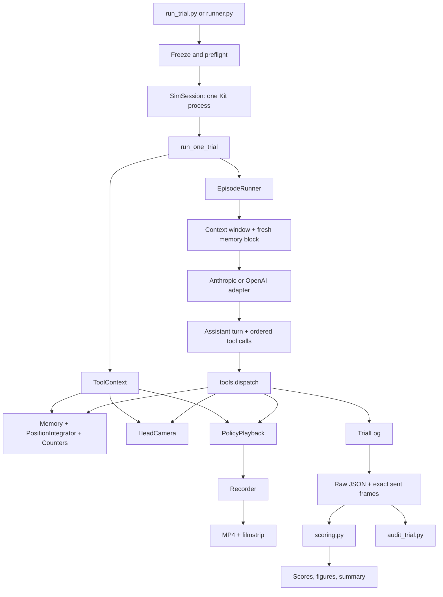

# Duck Embody v5d_r2 Harness Forensics

Status: evidence-complete investigation; remediation not yet implemented

Repository revision inspected: `eba035e9da4f21ef52c6807075d9b92f49d8c124`

Batch: `results/raw_v5d_r2`, 12 trials, `config_hash 0e9017a84c06…`

Investigation date: 2026-08-02

## Executive conclusion

The latest batch is not merely a case of frontier models failing a difficult
navigation task. It contains valid model failures, but it also exposes several
model-neutral harness defects.

The most consequential defect is the loop-closure affordance introduced before
`v5d_r2`. The harness stores the robot's position when a room or exit is first
mentioned, labels that position a room or doorway anchor, and instructs the
model to snap its position estimate to that anchor later. A room is an area, not
a point; an exit is often first marked from across a room, not while the robot
is in the threshold. Across the live batch:

- 16 `correct_position` calls were emitted.
- 15 were accepted and one was rejected.
- 14 of the 15 accepted corrections increased true localization error.
- One reduced error.
- Error summed over the accepted correction instants rose from 2.35 m before
  correction to 6.07 m after correction: a net 3.72 m added by loop closure.
- The largest single regression was `sonnet5_seed101`, where the estimate was
  0.024 m from truth and was snapped 1.504 m from truth.

This is a harness defect under AGENTS rule 4's boundary test: three unrelated
models used the documented affordance, and the harness systematically gave
them a false point anchor. It is not evidence that one contestant was weak at
navigation.

The second result-changing defect is the success predicate split:

- The live stage-1 gate in `duck_embody/tasks/find_kitchen.py::score_stage`
  still uses the pre-registered 0.35 m point disc.
- Published scoring in `duck_embody/scoring.py::stage_success` uses criterion v2,
  the union of the point disc and the 0.35 m band around any kitchen counter.
- `opus5_seed101` declared 0.3607 m from the point but 0.0577 m from a counter
  face. It is a published v2 success, but the live loop called it a failure and
  never offered `return_home`.

The batch therefore cannot be described as a complete run of the currently
published two-stage protocol. Stage-1 v2 scores are recoverable post hoc, but
the missing return leg is not.

The third core problem is execution-path coupling. Video recording monkey
patches `PolicyPlayback.execute` and splits every semantic command into 0.04 s
calls. That split has repeatedly changed behavior and still changes the
odometry stochastic process. The current noise standard deviation is linear in
per-call duration/distance, while independent chunk noise is vector-summed.
Splitting one command into N pieces therefore reduces aggregate standard
deviation by approximately `sqrt(N)` relative to an unsplit command. The batch
is internally consistent because every paid trial records video, but recorded
and unrecorded validation paths are not equivalent.

The latest results should be retained and cited as a provisional forensic
batch. They should not be deleted or selectively rerun. A new freeze and a new
full matrix are required after the confirmed behavioral fixes.

## What remains a valid result

The investigation does not invalidate every observation in `v5d_r2`.

- All 12 trial JSONs contain `final` blocks and five parsed QA answers.
- All 12 carry the same `config_hash 0e9017a84c06…`.
- All 12 have an mp4 and a full filmstrip.
- No trial contains an infrastructure failure, refusal, malformed tool call, or
  derailment nudge.
- No trial fell. The raw execution records and available videos support the
  conclusion that v5d locomotion is much more contact-tolerant than the v4
  policy.
- The old commanded-distance wedge inflation is absent. Model-facing odometry
  now tracks true net displacement to within centimetres on blocked calls.
- `sonnet5_seed104` reaching a counter but failing to call `declare_done` is a
  legitimate benchmark failure. Success requires the model to know it arrived.
- Poor seed-102 and seed-103 high-level route choices remain model outcomes when
  the harness feedback was truthful.

What is not currently defensible is the stronger claim that the complete
published v2 two-stage benchmark ran under a fully audited, reproducible,
sensor-realistic harness.

## Scope and method

This investigation covered:

- Current implementation under `duck_embody/`, `scripts/`, `configs/`, and
  tests.
- Approved design documents 01 through 06, `AGENTS.md`, `docs/METRICS.md`, and
  `docs/PLAN.md`.
- Git history from the v4 freeze through `v5d_r2`.
- All 12 `results/raw_v5d_r2/*.json` traces.
- Machine audit outputs, human audit Markdown, contact sheets, filmstrips,
  videos, freeze manifests, local overnight logs, and checkpoint provenance.
- Official OpenAI prompt-caching documentation for cache token semantics.

The analysis used direct raw-field aggregation rather than the generated audit
Markdown wherever those disagreed. In particular:

- Tool counts came from `turns[].model_output.tool_calls`.
- Motion facts came from `turns[].execution.calls[]`.
- True poses came from the per-call `true_pose` or turn-level `true_pose`.
- Position corrections came from cumulative
  `turns[].memory_snapshot.corrections`.
- Published stage metrics came from `results/scores_raw_v5d_r2.json`.

No new paid LLM or Isaac Sim run was necessary to establish the confirmed
defects. The existing batch already contains 434 live model turns and the
relevant counterexamples. New live runs should occur only after the fixes, when
they can discriminate whether the repaired contract works.

## Current architecture



### Batch and trial lifecycle

1. `duck_embody/runner.py` reads the model/seed matrix from
   `configs/benchmark.yaml`.
2. The runner validates the freeze manifest, API keys, and one-GPU rule before
   launching Kit.
3. `SimSession.launch` creates one `DuckEmbody-Apartment-v0` environment and
   loads the selected checkpoint.
4. Providers are built after Kit startup because importing the SDKs earlier has
   previously corrupted Anthropic request serialization.
5. Each trial resets the persistent environment to a seed-specific pose,
   creates a fresh camera, memory, integrator, counters, context, log, and
   recorder, then starts `EpisodeRunner`.
6. The scoring JSON is finalized before ffmpeg work so an evidence-encoding
   failure cannot force a paid trial rerun.

### One model turn

```mermaid
sequenceDiagram
    participant Loop as EpisodeRunner
    participant Mem as Memory
    participant LLM as Provider
    participant Tool as Dispatcher
    participant Sim as PolicyPlayback
    participant Log as TrialLog

    Loop->>Mem: Render current map, state, plan, budget
    Loop->>LLM: System + first/last context + fresh memory
    LLM-->>Loop: Native assistant turn and tool calls
    Loop->>Loop: Increment turn budget
    loop Each call in listed order
        Loop->>Tool: Dispatch call
        alt Motion
            Tool->>Sim: Execute command
            Sim-->>Tool: ExecResult
            Tool->>Mem: Apply odometry delta and breadcrumb
        else Memory or perception
            Tool->>Mem: Store model assertion
        end
        Tool-->>Loop: Model payload plus scoring-only execution
    end
    Loop->>Log: Save exact frames and structured turn record
    Loop->>Loop: Check fall, declaration, then caps
```

### Context policy

The model receives:

- A frozen system prompt and 12 tool schemas.
- The first transcript exchange plus the last ten exchanges after it.
- Images only while their exchange is inside the last-ten window.
- A fresh, non-persisted memory block appended on every request.
- Provider-native assistant turns echoed for reasoning/tool continuity.

The model does not receive a free initial image. All 12 `v5d_r2` trials spent
turn 1 on `look_around`, so this behavior was consistent across contestants.

### Trust boundary

Model-facing data:

- Head-camera JPEGs.
- Absolute compass heading.
- Dead-reckoned x/y estimate.
- Last-motion status and coarse body contact regions.
- Model-authored rooms, exits, landmarks, trajectory, plan, and anchors.
- Tool clamp/error messages and budget.

Scoring-only data:

- True poses and displacement.
- 5 Hz pose traces.
- Goal geometry, room polygons, counter footprints, and oracle paths.
- Fall diagnostics.
- Post-hoc map/QA answer keys.

The intended boundary is strong in `agent/tools.py`: a `ToolOutcome` contains a
model `payload` and a separate `execution` channel. `to_block` serializes only
the payload. Existing tests deliberately plant true-pose sentinels in fake
execution results and ensure no payload can carry them.

The live artifact is weaker than the unit boundary. Raw logs do not preserve
the exact ordered tool-result texts or provider-native request/response
envelopes, so the request sent during a paid trial cannot be reconstructed
byte-for-byte after the fact.

## Harness evolution and freeze eras

### v4 published baseline

- Freeze commit: `13f438d`.
- Config hash: `cf29ec164676…`.
- Matrix: Fable 5, Opus 5, GPT 5.6 sol.
- Results: `results/raw/`.
- Policy: vendored v4 robust checkpoint.
- Published result: one v2 success after post-batch criterion adoption, ten
  falls.

### Aborted pre-odometry v5d attempt

- Config hash: `6a65f33582eb…`.
- Matrix still contained Fable 5.
- Results: `results/raw_v5d/`.
- The attempt exposed 27.09 m of reported travel against 1.99 m true
  displacement in repeated blocked `send_velocity` calls.
- The interim contact-time discount was later measured ineffective and
  superseded. This directory is evidence, not a scored batch.

### Current v5d_r2

- Freeze commit recorded by the manifest: `84af3f8`.
- Config hash: `0e9017a84c06…`.
- Matrix: Sonnet 5, Opus 5, GPT 5.6 sol.
- Results: `results/raw_v5d_r2/`.
- Policy SHA-256 from the local sidecar:
  `301e24e336b2eab0ba387beb50fc16b03e6062b26622bc9a3e98588216a12c54`.
- Motion belief changed to simulated leg odometry.
- Automatic room/exit anchors and `correct_position(place=...)` were added.

`docs/PLAN.md` was never extended for the post-v4 work. `AGENTS.md` section 8
still closes the v4 batch as the project's final state. The top table in
`results/FREEZE_HISTORY.md` still labels `freeze.json` as the aborted
`6a65f335` configuration even though the live file is `0e9017a8`.

## v5d_r2 forensic baseline

Across all 12 trials:

- 434 model turns.
- 126 published bump-command counts.
- 0 falls.
- 11 `declare_done` calls; two trials reached the turn cap without declaring.
- 193 perception calls: 121 `get_observation` and 72 `look_around`.
- 343 motion calls: 159 `turn_to_heading`, 151 `move`, 33 `send_velocity`.
- 16 `correct_position` calls.
- Generated cost currently reported as $22.21, but the GPT portion is
  mis-accounted; see finding F-07.

Published v2 outcomes:

- Sonnet 5: 0/4 `find_kitchen`.
- Opus 5: 2/4 `find_kitchen`, 1/4 pre-registered.
- GPT 5.6 sol: 0/4 `find_kitchen`.
- `return_home`: 1/12 overall, 1/1 among actually offered legs.

Trajectory patterns:

- Seed 101: all three models reached the kitchen vicinity. Opus alone declared
  a v2-success pose.
- Seed 102: every model remained confused around the bedroom/hallway route;
  Opus accumulated 32.00 m path and 26 bump commands.
- Seed 103: long hallway/room-label confusion; Sonnet and Opus traveled
  19.12 m and 33.19 m respectively.
- Seed 104: Opus completed both stages; Sonnet reached a counter but never
  declared; GPT timed out far from the target.

### Per-trial evidence ledger

The following values come from `results/scores_raw_v5d_r2.json`; outcome is the
published v2 outcome. Cost is included for traceability but remains provisional
because of F-07.

Sonnet 5:

- Seed 101: `declared_elsewhere`; progress 0.541; true path 7.29 m; 39 turns;
  8 bumps; final drift 1.504 m; one correction; $1.204.
- Seed 102: `declared_elsewhere`; progress 0.091; true path 7.19 m; 40 turns;
  7 bumps; drift 0.061 m; no correction; $1.365.
- Seed 103: `declared_elsewhere`; progress 0.087; true path 19.12 m; 40 turns;
  9 bumps; drift 0.060 m; two corrections; $1.551.
- Seed 104: `timeout_turns`; progress 0.695; true path 9.80 m; 40 turns;
  4 bumps; drift 0.678 m; four corrections; $1.163. It ended only 0.060 m
  from a counter face but did not declare.

Opus 5:

- Seed 101: v2 `success`, pre-registered `declared_elsewhere`; progress 0.825;
  true path 8.02 m; 23 turns; 7 bumps; drift 0.042 m; no correction; $1.245.
  Return-home was not offered.
- Seed 102: `declared_elsewhere`; progress 0.128; true path 32.00 m; 40 turns;
  26 bumps; drift 0.264 m; one correction; $4.357.
- Seed 103: `declared_elsewhere`; progress 0.270; true path 33.19 m; 37 turns;
  16 bumps; drift 0.131 m; no correction; $3.718.
- Seed 104: stage-1 `success`; progress 0.843; true path 7.99 m; 22 turns;
  stage-1 drift 0.150 m; no stage-1 correction. Return-home also succeeded in
  9 turns over 4.90 m, with 0.197 m drift and three corrections. Trial bumps:
  6; cost $2.330.

GPT 5.6 sol:

- Seed 101: `declared_elsewhere`; progress 0.609; true path 4.90 m; 24 turns;
  4 bumps; drift 0.766 m; one correction; $0.869.
- Seed 102: `declared_elsewhere`; progress 0.000; true path 16.05 m; 40 turns;
  16 bumps; drift 0.057 m; no correction; $1.373.
- Seed 103: `declared_elsewhere`; progress 0.274; true path 10.40 m; 40 turns;
  14 bumps; drift 0.148 m; one accepted and one rejected correction; $1.582.
- Seed 104: `timeout_turns`; progress 0.000; true path 13.65 m; 40 turns;
  9 bumps; drift 0.377 m; two corrections; $1.450.

### Correction-effect ledger

Each effect is `error_after - error_before` at the physical instant the
correction executed. Positive is harmful.

- `gpt56sol_seed101` t16, `Living room@0`: +0.737 m.
- `gpt56sol_seed103` t10, blank place plus explicit x/y: rejected; no movement.
- `gpt56sol_seed103` t11, `LivingRoom@90`: +0.003 m.
- `gpt56sol_seed104` t29, broad room `Living room`: +0.339 m.
- `gpt56sol_seed104` t37, `Living room@45`: +0.056 m.
- `opus5_seed102` t25, `corridor_west@180`: +0.214 m.
- `opus5_seed104` return t3, `kitchen@195`: +0.137 m.
- `opus5_seed104` return t6, `living_dining@15`: +0.015 m.
- `opus5_seed104` return t9, broad room `living_dining`: +0.037 m.
- `sonnet5_seed101` t21, `RedRoom@0`: +1.480 m.
- `sonnet5_seed103` t12, `Alcove1@270`: +0.002 m.
- `sonnet5_seed103` t30, broad room `Hallway1`: +0.053 m.
- `sonnet5_seed104` t15, broad room `LivingRoomRed`: +0.057 m.
- `sonnet5_seed104` t20, `LivingRoomRed@270`: +1.025 m.
- `sonnet5_seed104` t21, broad room `DiningArea`: −1.020 m. This immediately
  undid most of the preceding bad correction and is the only improvement.
- `sonnet5_seed104` t29, `DiningArea@270`: +0.585 m.

## Finding severity

- P0: changes the task presented or removes an entire stage; new benchmark
  results are required.
- P1: materially biases behavior, auditability, or reported numbers; must be
  fixed before the next freeze.
- P2: latent or reporting defect with bounded direct impact; fix before
  publication or document explicitly.

## F-01 — Automatic anchors make loop closure systematically wrong

Severity: P0

Confidence: confirmed by code and 15 live accepted calls

### Evidence

`Memory.update_room` stamps `Room.anchor_xy` at the first room assertion.
`Memory.mark_exit` stamps `Exit.anchor_xy` at the first exit assertion and does
not update it on later `leads_to:` writes. The prompt then says:

- Every place and doorway shows an anchor.
- `correct_position(place=...)` can snap to a room or doorway by name.
- Re-anchor the moment a marked doorway is crossed.
- A doorway anchor is the tightest anchor.

Those statements imply the stored coordinate is the doorway threshold or a
unique place within a room. It is actually the robot location from which the
model first described the room or saw the exit.

Live correction outcomes, measured at each call's true pose:

- `sonnet5_seed101` t21: 0.024 m error became 1.504 m.
- `gpt56sol_seed101` t16: 0.028 m became 0.764 m.
- `sonnet5_seed104` t20: 0.072 m became 1.097 m.
- `sonnet5_seed104` t29: 0.110 m became 0.695 m.
- `opus5_seed102` t25: 0.042 m became 0.256 m.
- All three accepted `opus5_seed104` return corrections slightly worsened the
  estimate, despite that trial succeeding.
- Only `sonnet5_seed104` t21 improved error, because it immediately undid the
  preceding incorrect room snap.

The existing `smoke_odometry.py` anchor test only proves that
`correct_position` copies a stored coordinate. It does not move away, revisit
the same physical point, and assert that correction improves true error. It
therefore validated mechanics while missing semantics.

### Root cause

Data association is being inferred from the wrong event. Mentioning a doorway
from a distance is not asserting "I am standing at this doorway." Recognizing a
room is not recognizing one point within the room.

### Required direction

Replace automatic room/exit anchors with explicit point anchors authored by the
model while physically at a recognizable point. A future tool should separate:

- Recording an anchor at the current estimate with a short visual signature.
- Correcting to an existing anchor after recognizing the same point.
- Explicit coordinate correction when the model has independently reasoned an
  x/y value.

The harness may store these assertions; it must not decide which visual place
the robot is in.

### Falsifier

None for the existing implementation: the systematic live results already
confirm the defect. A repaired implementation must demonstrate a true revisit
where correction lowers true error.

## F-02 — Live success and published success are different tasks

Severity: P0

Confidence: confirmed

### Evidence

The published criterion in `docs/METRICS.md` is v2 any-counter. The live task
still calls `tasks/find_kitchen.py::score_stage`, which measures only distance
to `(2.55, 0.75)`.

`opus5_seed101`:

- Declared at true pose `(2.4277, 0.4107)`.
- Point distance: 0.3607 m, so the live loop recorded `declared_elsewhere`.
- Nearest counter-face distance: 0.0577 m while inside the kitchen, so the
  published scorer records success.
- `return_home` was never offered.

The generated scores expose
`stage1_successes_never_offered_return: 1`. That is disclosure, not recovery.

### Root cause

Criterion v2 was implemented only in post-hoc `scoring.py`. The task predicate
that decides the live stage machine remained frozen on criterion v1.

### Required direction

Create one versioned goal-region predicate used by both the live gate and the
scorer. New trial logs must stamp the criterion version. Legacy logs without
the stamp must remain interpretable as point-disc-as-run while preserving the
v2 sensitivity result.

### Falsifier

A grid/property test over the apartment showing that live and published
predicates agree at every sampled pose would falsify this finding. The
`opus5_seed101` pose currently fails that test.

## F-03 — Recording changes execution and odometry statistics

Severity: P0 for architecture, P1 for within-batch comparisons

Confidence: confirmed by code; magnitude requires a post-fix smoke

### Evidence

`sim/recorder.py::attach_recorder` replaces `playback.execute` with a wrapper
that calls the original execution in 0.04 s pieces. The project has already
fixed several bugs caused by this seam:

- Bump debounce could not reach three steps inside a two-step chunk.
- Contact groups and fall diagnostics were dropped by a duplicate merge.
- Pose traces were sampled at the wrong frequency.
- A per-call odometry floor accrued about 25 times per second.
- Per-chunk distance magnitudes turned wall jitter into reported travel.

The current code still samples independent x/y noise once per execute call:

`sigma = 0.03 * true_distance + 0.001 * duration`

For an unsplit command with standard deviation `sigma_total`, splitting into N
equal pieces gives each piece approximately `sigma_total / N`. Vector-summing
independent pieces yields aggregate standard deviation:

`sqrt(N) * sigma_total / N = sigma_total / sqrt(N)`

The noise process therefore depends on whether video is attached. The paid
batch uses the recorded path; several unit and early smoke paths do not.

### Root cause

Observability was implemented by changing command boundaries instead of by
observing fixed control steps.

### Required direction

Add a per-control-step observer/callback inside `PolicyPlayback.execute`.
Recording should sample frames without replacing or splitting the semantic
motion call. Generate odometry on a fixed control-step process or finalize it
once at the semantic command boundary with a mathematically chunk-invariant
noise model.

### Falsifier

With the same seed and scripted commands, recorded and unrecorded runs must
produce byte-identical motion results except for video metadata. The current
implementation cannot satisfy this structurally.

## F-04 — Motion/contact semantics reward blind thrashing

Severity: P1

Confidence: confirmed behavior; final policy choices require smoke validation

### Evidence: blind multi-motion turns

The prompt encourages bundling tool calls. The loop executes every listed
motion call before the model sees any result.

- 52 of 434 turns contained more than one motion command.
- Several Opus failure turns executed four or five motion calls.
- `opus5_seed102` t23 executed 20.6 policy-seconds in one model turn.
- A maximum-length blind sequence can traverse a large fraction of the
  4.8 m × 3.6 m apartment without an intervening decision.

The common useful pair is turn then move. Multi-leg sequences such as
turn/move/turn/move should require another model observation and decision.

### Evidence: `move` does not servo measured distance

The tool description says `move` is closed-loop on dead-reckoned distance.
The implementation stops when a k-adjusted commanded-time integral reaches the
target. It reports odometry only after the fact.

One live example, `sonnet5_seed102` t23:

- Requested 0.4 m.
- Macro returned `stop_reason=reached`.
- True displacement was 0.095 m.
- Reported odometry was 0.099 m.
- Contact was reported.

The payload was sufficient for the model to infer obstruction, but the macro
did not fulfill its advertised measured-distance contract.

### Evidence: sustained-contact timing is not the advertised 0.4–0.5 s

`move` calls `execute(..., stop_on_bump=True)` for a nominal 0.2 s chunk.
`execute` returns as soon as the three-step debounce confirms contact. The
outer macro then counts two "bumping chunks." Those chunks may each contain
only a few control steps; they are not necessarily two complete 0.2 s windows.
The shortest live bump-stopped move consumed 0.24 policy-seconds including
settling, and many ended in 0.4–0.7 s total.

### Evidence: turns keep pushing into contact

`turn_to_heading` has no sustained-contact abort. Live traces contain repeated
8.2 s turn timeouts with `bumped=true` and centimetres of displacement, for
example `gpt56sol_seed102` turns 29–30.

### Required direction

- Offer one atomic `turn_and_move` macro whose heading/distance are chosen by
  the model.
- Permit at most one translational macro or one atomic navigation macro per
  model turn; return structured `not_executed` results for later motion calls.
- Servo on measured odometry, with bounded timeout and explicit
  `target_reached`.
- Track contact duration across control steps and commands.
- Abort both translation and rotation on a documented sustained-contact
  threshold.
- Add a signed or dedicated closed-loop back-up macro so recovery does not
  require raw open-loop velocity.

These are low-level command-interface changes. They do not choose a route and
therefore remain inside AGENTS rule 5.

## F-05 — Collision metrics are command-dependent, not event-dependent

Severity: P1

Confidence: confirmed

The published bump counter increments for bumped `move` and `send_velocity`
commands but not `turn_to_heading`.

Across `v5d_r2`:

- 102 `move` calls reported contact.
- 24 `send_velocity` calls reported contact.
- 72 `turn_to_heading` calls reported contact but were excluded.
- The published total is 126, while 198 motion commands reported contact.

Repeated commands while continuously wedged each add another bump, so the
metric can both undercount turns and overcount a single persistent collision.

A future result should report:

- Distinct collision events, defined by debounced contact rising edges after a
  documented release period.
- Total contact time.
- Contact regions.
- Legacy bumped-command count for backward comparison.

## F-06 — Batch provenance does not bind all outcome-affecting inputs

Severity: P1

Confidence: confirmed

`FROZEN_FILES` covers 19 important files but excludes:

- `duck_embody/runner.py`, which owns reset, camera/recorder attachment, context
  construction, checkpoint passing, finalization, and retries.
- `pyproject.toml`, which points at and pins the parent repository.
- The policy checkpoint bytes.
- `assets/manifest.json` and `assets/checksums.txt`.
- The external parent repository code and robot USD.
- The exact batch invocation.

The local sidecar `results/logs/provenance_raw_v5d_r2.json` records the
checkpoint SHA, but `results/logs/` is ignored and that sidecar is not included
in the committed portfolio artifacts.

The overnight log also records:

`Parent repo commit MISMATCH: pinned 2fc57c9…, actual 0d0db06…`

The batch continued after a warning that explicitly said the results were not
comparable. A later diff shows no runtime files under the robot/environment
paths changed between those revisions; the mismatch did not demonstrably alter
this batch's physics. The guard is still ineffective and the public artifacts
alone cannot establish that nuance.

The default checkpoint is another footgun:

- `SimSession.DEFAULT_CHECKPOINT` remains v4 `policy/model_2999.pt`.
- `K_VELOCITY_REALISATION` is calibrated to v5d.
- Omitting `--checkpoint` silently pairs v4 weights with v5d servo calibration.

Required direction:

- Create a write-once batch manifest before spending.
- Include exact checkpoint path and SHA, parent commit and dirty state, runner
  commit/SHA, asset manifest and binary checksum verification, criterion
  version, model aliases, exact CLI, and environment versions.
- Copy the manifest beside the batch and reference its SHA in every trial.
- Hard-refuse a parent/checkpoint/calibration mismatch in benchmark mode.
- Preserve warning-only behavior for exploratory smoke mode if useful.

## F-07 — GPT cost is over-counted and cache writes are discarded

Severity: P1 for cost reporting, no capability impact

Confidence: confirmed by official API semantics and arithmetic

OpenAI Responses `usage.input_tokens` is the total input count.
`usage.input_tokens_details.cached_tokens` is a subset. The adapter stores both
as if they were disjoint, and the shared cost function charges:

`input_tokens * full_rate + cached_tokens * cached_rate`

It therefore charges cached tokens twice. GPT-5.6 also reports
`cache_write_tokens`, billed at 1.25×, but `OpenAIProvider._parse` does not store
that field.

Using only recoverable fields and assuming zero unlogged write charge:

- Published GPT sum: $5.274588.
- Corrected lower bound: $3.479658.
- Known overstatement from double-counted cache reads: $1.794930.

The true historical cost cannot be reconstructed exactly because cache-write
usage was discarded.

Source:
`https://developers.openai.com/api/docs/guides/prompt-caching?prompt-cache-api=responses`

Required direction:

- Normalize provider usage into explicit total, uncached, cache-read, and
  cache-write fields.
- Use provider-specific billing formulas.
- Add GPT-5.6 `cache_write_tokens`.
- Use controlled live probes with known cached/uncached prefixes before
  re-publishing costs.
- Mark historical corrected costs as bounds when write tokens are unavailable.

## F-08 — Machine audit PASS does not mean the batch was fully audited

Severity: P1

Confidence: confirmed

All 12 `*_audit.txt` files say:

`outside results/raw/ — freeze-hash check skipped`

The overnight wrapper did not set `DUCK_EMBODY_RAW_DIR` for each audit, so the
key same-freeze assertion was skipped while the final line still read
`AUDIT PASS`.

The human audit layer is also incomplete:

- 12/12 mp4s and filmstrips exist.
- Only two audit Markdown files contain completed visual narratives.
- Ten still contain `_pending visual pass`.
- The contact-sheet set is incomplete.

`scripts/auto_audit.sh` reads fields that do not exist:

- `d.get("corrections")` instead of per-turn memory corrections.
- `stages.*.drift_m`, although drift is produced only by the scorer.

Consequences:

- `sonnet5_seed101.md` says zero corrections even though the raw trace contains
  the batch's worst harmful correction.
- `opus5_seed104.md` says zero corrections and `drift=None` despite three
  return-home corrections and scored drift.

Required direction:

- Make the auditor require an explicit batch manifest and fail when no hash
  check ran.
- Generate quantitative audit data from one shared parser.
- Treat pending visual verdicts as audit failure.
- Complete and sign 12/12 frame-by-frame verdicts before publication.
- Preserve video as authoritative when metrics disagree.

## F-09 — Paid requests are not reconstructable from the trial JSON

Severity: P1

Confidence: confirmed

The JSON stores parsed model output, frame files, memory snapshots, and scoring
execution. It does not store:

- Exact ordered tool-result texts returned to the model.
- Which saved frames belonged to which serialized tool result in the next
  request.
- Provider-native assistant output required for replay.
- Resolved provider model/version or response IDs.
- A provider-neutral or provider-native request hash.

`audit_trial.py` scans selected logged fields for banned names. It cannot prove
that the live provider request contained only those fields. Unit tests strongly
validate the construction path, but the paid artifact does not prove which path
ran on a particular turn.

Required direction:

- Log an exact provider-neutral request manifest per turn.
- Store ordered tool-result text, error flag, labels, frame paths, and frame
  SHA-256.
- Store provider-native item types and sanitized replay data or cryptographic
  hashes where provider terms prohibit public content.
- Record configured and resolved model IDs plus response/request IDs.
- Reconstruct every harness-authored request from the frozen prompt, schemas,
  prior raw hashes, tool-result manifest, and saved frame bytes.

## F-10 — `correct_position` input modes are ambiguous

Severity: P2

Confidence: confirmed

`gpt56sol_seed103` turn 10 sent:

`place=""`, `x=1.12`, `y=2.76`, plus a valid reason.

The handler treats the presence of any `place` value as authoritative. Empty
place fails lookup and prevents fallback to x/y. The call was rejected; the
model spent the next turn correcting by doorway name.

Treating blank `place` as absent would fix this narrow case. The stronger
solution is to split anchor correction and coordinate correction into separate
schemas so "either/or" is not represented as four simultaneously optional
fields.

## F-11 — Last-motion status is grammatically present-tense

Severity: P2

Confidence: confirmed ambiguity

`get_observation` and `look_around` repeat the prior command's
`bumped/contact/distance_moved_m` values. The contract says these describe the
last motion, but the keys are present-tense and contain no command ID or age.

Examples include perception-only turns that return `bumped: true` and a nonzero
distance. The values are not false, but they are easy to read as current
contact.

Rename the block to `last_motion`, include the tool/global-turn identifier, and
separately report current contact if a live sensor field is desired.

## F-12 — Reporting and institutional memory are stale

Severity: P2

Confidence: confirmed

- `results/summary_table_raw_v5d_r2.md` hardcodes links under `videos/`; actual
  files are in `videos_v5d_r2/`.
- Its footer points readers to `results/scores.json` and `results/raw/` instead
  of the redirected batch.
- `scoring_criterion.changed_post_batch` is always true, even though v2 was
  adopted before `v5d_r2` ran.
- The return-home row says "given stage-1 success" but uses only legs the old
  gate offered; Opus has two published stage-1 successes and denominator one.
- `results/FREEZE_HISTORY.md` top table names the aborted hash as current.
- `AGENTS.md` section 8 and README still present v4 as the final project state.
- `docs/PLAN.md` contains no v5d/odometry remediation tasks.
- Several design sections and the `PositionIntegrator` docstring still describe
  commanded-velocity integration as current.

These do not change physics, but they make a reviewer verify the wrong batch
and make future agents likely to reintroduce retired behavior.

## Additional latent risks

### Model aliases are not resolved in the artifact

The YAMLs use provider aliases such as `claude-opus-5` and `gpt-5.6-sol`. The
raw response's resolved model/version is not logged. Trials within one
three-hour batch are likely consistent, but comparisons across batches cannot
prove the provider served identical snapshots.

Prefer snapshot IDs where available and log the resolved ID on every response.

### Contact left/right grouping depends on body order

`PolicyPlayback` walks `contact_sensor.body_names` and flips from left to right
when it encounters a specific right-hip name. A future USD reorder can silently
swap contact labels. Assert a body-name fingerprint or map by explicit
kinematic ancestry.

### Odometry remains optimistic under foot slip

The simulated leg odometry is true base displacement through a noise model. A
real stance estimator can integrate phantom motion when feet slip. The project
records this deviation. It should remain a disclosed limitation unless future
claims concern real odometry quality.

### Same-model scene tuning

Sonnet 5 became a contestant after it had served as the historical scene judge.
The judge configuration was moved to Sonnet 4.6 for future runs, but the scene
was already tuned under Sonnet 5. This is a fairness caveat, not a demonstrated
advantage: Sonnet scored 0/4. Future scene gates should use multiple
non-contestant judges or a frozen human rubric.

## Exonerated suspicions and things not to “fix”

### The parent mismatch did not demonstrate changed physics

The warning was real and should have been fatal in benchmark mode. A diff
between the pinned and batch parent revisions shows no changed runtime robot or
environment files. Report the provenance failure without claiming unsupported
physics corruption.

### Sonnet seed 104 is a valid failure

It reached the v2 region but never called `declare_done`. Adding a grace turn or
auto-success would change the task and reward arriving without localization.

### Poor room naming and route choice are model behavior

The harness must not merge rooms, infer adjacency, rank frontiers, or navigate
to the kitchen. Those would cross AGENTS rule 5.

### No evidence of an active camera-mount failure

The sibling camera mount, image labels, and warmup path were consistent with
the inspected frames. The historical parented-camera sky/self-head failures
remain closed.

### No evidence of provider parse/refusal failures

All 434 turns have tool calls, no parse errors, no refusals, and no derailment
nudges. Provider changes are needed for auditability and accounting, not because
these trials crashed.

### The old wedge inflation is fixed

The v4 commanded-distance failure is absent. The remaining odometry concern is
recording-dependent stochastic semantics and optimistic slip modeling, not
another 25 m inflation.

## Validity disposition

Preserve `raw_v5d_r2` unchanged and label it:

- Complete same-hash forensic batch.
- Valid evidence for zero observed falls, contact-tolerant locomotion, model
  behavior, and the discovered harness defects.
- Provisional for published navigation comparison.
- Incomplete for the published two-stage v2 protocol because one v2 success
  was denied stage 2.
- Not rule-11 complete because 10/12 visual audits remain pending.
- Cost values provisional, especially GPT.

Do not selectively rerun `opus5_seed101`. Any behavioral repair changes frozen
files and requires a new full 3×4 batch in a new directory.

## Evidence index

Primary batch:

- `results/raw_v5d_r2/*.json`
- `results/scores_raw_v5d_r2.json`
- `results/summary_table_raw_v5d_r2.md`
- `results/videos_v5d_r2/*.mp4`
- `results/videos_v5d_r2/*_filmstrip.png`
- `results/audits_v5d_r2/*.md`
- `results/raw_v5d_r2/*_audit.txt`

Freeze and history:

- `results/freeze.json`
- `results/freeze_v4_baseline.json`
- `results/freeze_pre_odometry_20260730.json`
- `results/FREEZE_HISTORY.md`
- `results/rerun_log.md`

Local ignored evidence:

- `results/logs/overnight_bench.log`
- `results/logs/provenance_raw_v5d_r2.json`
- `results/logs/smoke_odometry.json`

Core code:

- `duck_embody/agent/loop.py`
- `duck_embody/agent/tools.py`
- `duck_embody/agent/memory.py`
- `duck_embody/agent/prompts.py`
- `duck_embody/agent/providers/{base,anthropic,openai}.py`
- `duck_embody/sim/{session,policy_wrapper,recorder}.py`
- `duck_embody/env/{camera,embody_env_cfg,scene_builder,apartment_layout}.py`
- `duck_embody/tasks/find_kitchen.py`
- `duck_embody/scoring.py`
- `duck_embody/runner.py`

External:

- OpenAI prompt caching:
  `https://developers.openai.com/api/docs/guides/prompt-caching?prompt-cache-api=responses`
